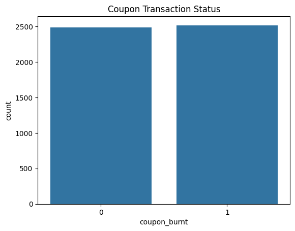

# E-commerce Customer Segmentation Analysis

## Project Overview
This project analyzes e-commerce customer data to segment customers based on their behavior and characteristics. The analysis includes exploratory data analysis (EDA) and K-means clustering to identify distinct customer groups.

## Data Sources
The data is sourced from an Excel file named 'E-commerce_data.xlsx' containing multiple sheets:
- customers
- genders
- cities
- transactions
- branches
- merchants

## Analysis Steps

### 1. Data Preparation
- Merged multiple dataframes to create a comprehensive dataset
- Handled missing values
- Created a binary 'coupon_burnt' column

### 2. Exploratory Data Analysis (EDA)
Several visualizations were created to understand the data distribution:

*Gender distribution of customers*

*Distribution of customers across cities*

*Distribution of coupon burn status*

*Trend of coupon burns over time*

*Frequency of coupon usage by customers*

*Distribution of coupon burn rates across customers*

### 3. Customer Segmentation
- Used K-means clustering algorithm
- Determined optimal number of clusters using elbow method and silhouette score
- Visualized clusters

*Elbow method for determining optimal number of clusters*

*Silhouette score for different numbers of clusters*

*Visualization of customer clusters*

## Results
The analysis identified 2 distinct customer segments based on their behavior and characteristics. Further investigation into these segments can provide insights for targeted marketing strategies and personalized customer experiences.

## Technologies Used
- Python
- Pandas
- NumPy
- Matplotlib
- Seaborn
- Scikit-learn

## Future Work
- Deeper analysis of cluster characteristics
- Predictive modeling for customer behavior
- Implementation of recommendations based on segmentation